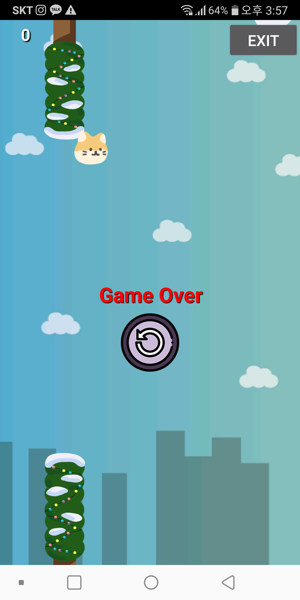

# 치삼이 점퍼 게임

기존의 오픈소스 파일인 jumper게임을 시나리오를 새롭게 하여 개발하였다.
[기존 게임 소스](https://github.com/anji314/jumper) 

### 새롭게 구현한 기능

- 캐릭터의 포물선 점프 
- 장애물들의 이동     
    -> 장애물을 총 40개로 이루어져 있으며 20개를 넘었을 시 장애물의 움직임이 추가.(늘어났다 줄어듬), 
- 배경의 흐름
- 난이도 추가   
    -> 장애물 5개를 넘을 때마다 통과할 수 있는 장애물 사이의 공간이 줄어들어 난이도의 개념 도입.
- 종로버튼 과 재시작 버튼

 
 

 

 
 

